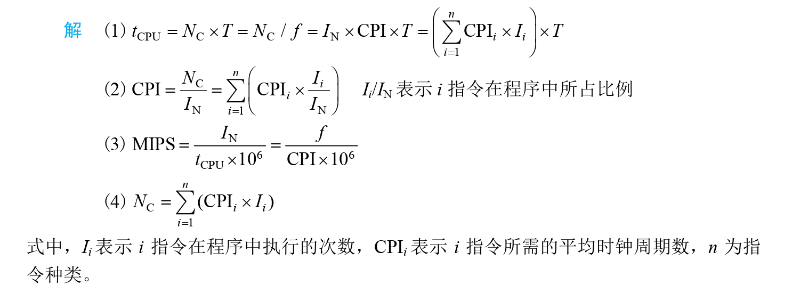

# 计算机组成原理笔记

> *The magic you are looking for is in the work you're avoiding.*
> *你在寻找的奇迹就隐藏在你一直逃避的行动里*
## 第一章 计算机系统概论

### 计算机的性能指标

**吞吐量**  
表征一台计算机在某一时间间隔内能够处理的信息量。响应时间表征从输入有效到系统产生响应之间的时间度量，用时间单位来度量。

**利用率**  
在给定的时间间隔内系统被实际使用的时间所占的比率，用百分比表示。

**处理机字长**  
指处理机运算器中一次能够完成二进制数运算的位数，如32位、64位。

**总线宽度**  
指CPU中运算器与存储器之间进行互连的内部总线二进制位数。

**存储器容量**  
存储器中所有存储单元的总数目。存储容量的单位通常是以二进制的幂来表示的：

- **KB（Kilobyte）**: 1 KB = 2^10 bytes = 1,024 bytes
- **MB（Megabyte）**: 1 MB = 2^20 bytes = 1,024 KB = 1,048,576 bytes
- **GB（Gigabyte）**: 1 GB = 2^30 bytes = 1,024 MB = 1,073,741,824 bytes
- **TB（Terabyte）**: 1 TB = 2^40 bytes = 1,024 GB = 1,099,511,627,776 bytes

这意味着存储器大小会按照2的幂次方来增加，此种增加方式在计算机科学中是常规的，因为计算机是基于二进制的。

**存储器带宽**  
单位时间内从存储器读出的二进制数信息量，一般用字节数/秒表示。

**主频/时钟周期**  
CPU的工作节拍受主时钟控制，主时钟不断产生固定频率的时钟，主时钟的频率叫CPU的主频。度量单位是MHz(兆赫兹)、GHz(吉赫兹)。主频的倒数称为CPU时钟周期(T)，$ T = 1/f $，度量单位是μs、ns。

**CPU执行时间**  
表示CPU执行一般程序所占用的CPU时间，可用下式计算：CPU执行时间 = CPU时钟周期数 $\times$ CPU时钟周期。

**CPI (Cycles per instruction)**  
表示每条指令周期数，即执行一条指令所需的平均时钟周期数。用下式计算：CPI = 执行某段程序所需的CPU时钟周期数 ÷ 程序包含的指令条数。

**MIPS (Million Instructions Per Second)**  
表示平均每秒执行多少百万条定点指令数，用下式计算：MIPS = 指令数 ÷（程序执行时间 × $10^6$）。

**FLOPS (Floating-point Operations Per Second)**  
表示每秒执行浮点操作的次数，用来衡量机器浮点操作的性能。用下式计算：FLOPS = 程序中的浮点操作次数 ÷ 程序执行时间(s)。

*题目的命制往往围绕着时钟周期T, CPU执行时间, CPI, MIPS, FLOPS的互相推导来进行 一下总结一些常见公式*

在题目中，我们发现若干重要的恒等关系。这里，我们特别说明从(3)得到的恒等式：

$$I_N \cdot CPI = f \cdot t_{CPU}$$

这个恒等式表示，左边的 $I_N \cdot CPI$ 代表总的时钟周期数（记为 $N_C$）。而右边的 $f \cdot t_{CPU}$ 代表执行程序所需的CPU时间乘以频率 $f$（也就是总时间除以时钟周期），同样代表总时钟周期数，即 $N_C$。因此，我们有：

$$I_N \cdot CPI = f \cdot t_{CPU} = N_C$$

进一步分析CPI的含义，它代表执行一条指令所需的平均时钟周期数。因此，$CPI$ 不是一个固定的值，而应该表示为第 $i$ 条指令的平均时钟周期数，即 $CPI_i$。 

所以，$CPI$ 应该是每条指令的 $CPI_i$ 的加权平均数，可以表示为：

$$CPI = \sum\limits_{i=1}^{n} \left( CPI_i \times \frac{I_i}{I_N} \right)$$

这样，我们可以用 "守恒" 的理念将记忆的四个公式转变一个公式。给出最长的恒等式为：

$$
I_N \cdot CPI = I_N \cdot \sum\limits_{i=1}^{n} \left( CPI_i \times \frac{I_i}{I_N} \right) = \sum\limits_{i=1}^{n} \left( CPI_i \times I_i \right) = f \cdot t_{CPU} = N_C=总时钟周期数
$$

**冯·诺依曼机**
- **基本思想:** *存储程序* —— 把待执行的程序（指令序列）存放在存储器中
- **构成要素:**
  - *运算器（Arithmetic Logic Unit, ALU)* —— 执行算术和逻辑运算
  - *控制器（Control Unit, CU)* —— 控制程序执行的顺序和操作
  - *存储器（Memory)* —— 存放程序和数据，按地址访问
  - *输入设备（Input Devices)* —— 用于数据输入
  - *输出设备（Output Devices)* —— 用于显示结果

**记忆口诀:** *"运控存进出,顺序地址存"*(顺序执行,按地址访问,存储程序)